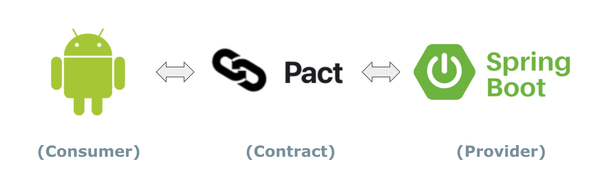

# Consumer Driven Contract Testing using [Pact](https://docs.pact.io/)

Code sample using Pact with Android frontend and Spring Boot backend.
  
  
  
  
  
## Contract

This sample uses [Packflow](https://pactflow.io/) to share and view Pact contracts. [View an example pact here.](https://htmlpreview.github.io/?https://github.com/pivotal-djoo/pact-sample/blob/master/assets/pact.html)  
  
To fully try out this sample, create an account on [Packflow](https://pactflow.io/) and replace the `PACT_BROKER_BASE_URL` and `PACT_BROKER_TOKEN` below with your own.
  
  
  
## Test Samples

[AddToDoContractTest.kt](todo-android/app/src/test/java/com/example/todo/contracts/AddToDoContractTest.kt)

[GetToDosContractTest.kt](todo-android/app/src/test/java/com/example/todo/contracts/GetToDosContractTest.kt)

[PactVerificationTest.java](todo-server/src/test/java/com/example/todoserver/contracts/PactVerificationTest.java)

  
  
## Getting Started

1. Open the To Do Android project in Android Studio

2. Gradle build task will generate a pact file in app/build/pacts folder based on existing contract tests [AddToDoContractTest.kt](todo-android/app/src/test/java/com/example/todo/contracts/AddToDoContractTest.kt) and [GetToDosContractTest.kt](todo-android/app/src/test/java/com/example/todo/contracts/GetToDosContractTest.kt).

```
cd todo-android
./gradlew clean build
```

3. Gradle pactPublish task will publish the pact file into a pact broker. Be sure to specify the following environment variables used in [app/build.gradle](todo-android/app/build.gradle)

Environment variables needed for To Do Android. Add these when running `pactPublish` gradle task.
```
PACT_BROKER_BASE_URL=https://djoo.pactflow.io
PACT_BROKER_TOKEN=[pactflow-read/write-token]
```

These env vars are read in the pact.publish section in the [app/build.gradle](todo-android/app/build.gradle)
``` 
pact {
    publish {
        pactBrokerUrl = System.getenv('PACT_BROKER_BASE_URL')
        pactBrokerToken = System.getenv('PACT_BROKER_TOKEN')
    }
}
```

To publish the latest pact file to a pact broker: (Pactflow in this example)
```
cd todo-android
./gradlew pactPublish
```


4. Contract tests in To Do Server project validates the API to the published pact file. Be sure to specify the following environment variable needed to run the [PactVerificationTest.java](todo-server/src/test/java/com/example/todoserver/contracts/PactVerificationTest.java)

Environment variables needed for To Do Server. Note the base url has removed the method "https://" portion. Add these when running [PactVerificationTest.java](todo-server/src/test/java/com/example/todoserver/contracts/PactVerificationTest.java)
```
PACT_BROKER_BASE_URL=djoo.pactflow.io
PACT_BROKER_TOKEN=[pactflow-read/write-token]
```

Flag `pact.verifier.publishResults=true` specified in [todo-server/build.gradle](todo-server/build.gradle) test block publishes verification results to Pactflow after running tests.

To verify, simply run the [PactVerificationTest.java](todo-server/src/test/java/com/example/todoserver/contracts/PactVerificationTest.java)

```
cd todo-server
PACT_BROKER_BASE_URL=[pactflow-url] PACTBROKER_AUTH_TOKEN=[pactflow-read/write-token] ./gradlew test --tests "*PactVerificationTest*"
```

5. Sign on to [Packflow](https://pactflow.io/) and confirm a pact is present and verified.


